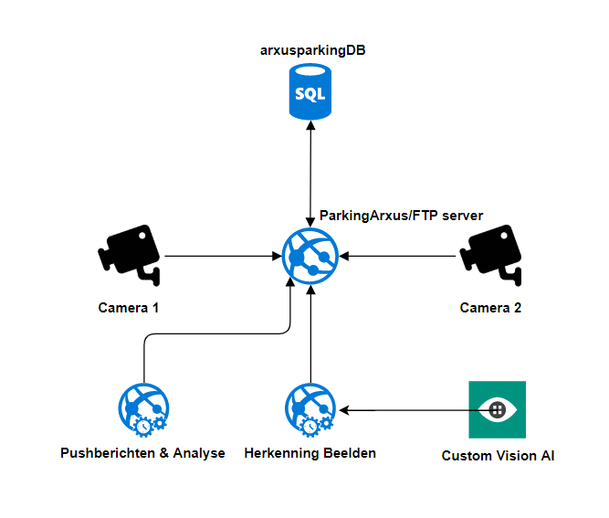

# EyePark

/webjobs/ bevat alle scripts die als webjob moeten draaien binnen de app service in Azure
1. analysis.py : analyse uitvoeren op data vanuit de databank en resulaten ernaar wegschrijven
2. herkenningscript.py : analyseren van binnenkomende foto's en resultaten wegschrijven naar de databank
3. photocopy.py : neem backup foto's om het uur en slaag deze op op de server (app service)
4. pushbericht.py : stuur om het uur een bericht met hoeveel plaatsen er momenteel vrij zijn per parking

/websitecode/ArxusParking bevat alle python code die gepublished moet worden naar een app servcice in Azure

/yolov3-master bevat alle code en scripts voor modeluitbreiding binnen Azure
1. sudo chmod +x packages.sh
2. sudo ./packages.sh
3. python3 detect.py --cfg cfg/yolov3.cfg --weights weights/yolov3.weights
output met getekende boudning boxes staat in de map /output

/documenten bevat alle word documenten met handleidingen en documentatie voor het opzetten van dit project
